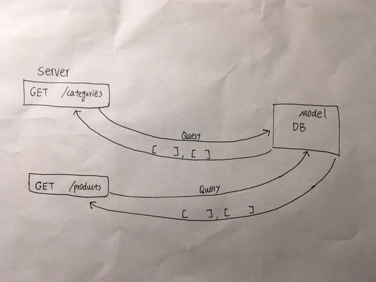

# LAB - 08

## Express Routing and Connection

### Author: David Zheng 

### Links and Resources
* [submission PR](https://github.com/dzheng24/lab-08/pull/1)
* [travis](https://travis-ci.com/dzheng24/lab-08)
* [back-end](https://davidzheng-lab-08.herokuapp.com/) (when applicable)

#### Documentation
I received help from Jacob to make sure the express server is running, and connected routes and mongoose to categories and products. Current setup passes travis. 

JSDOCS will be included when I make more progress on this lab. 

  
#### Tests
* unit test: `npm test`
* lint test: `npm run lint`

#### UML

